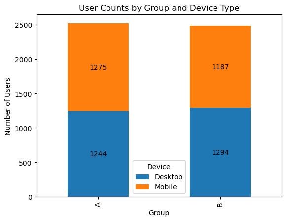
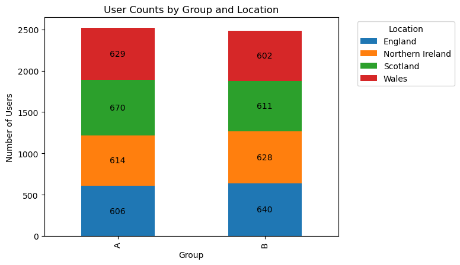
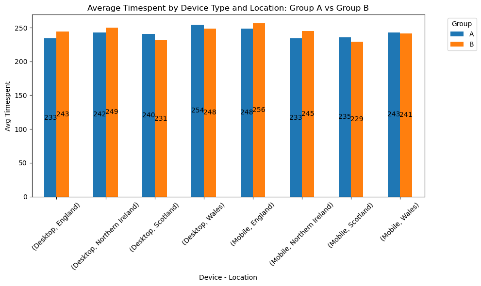
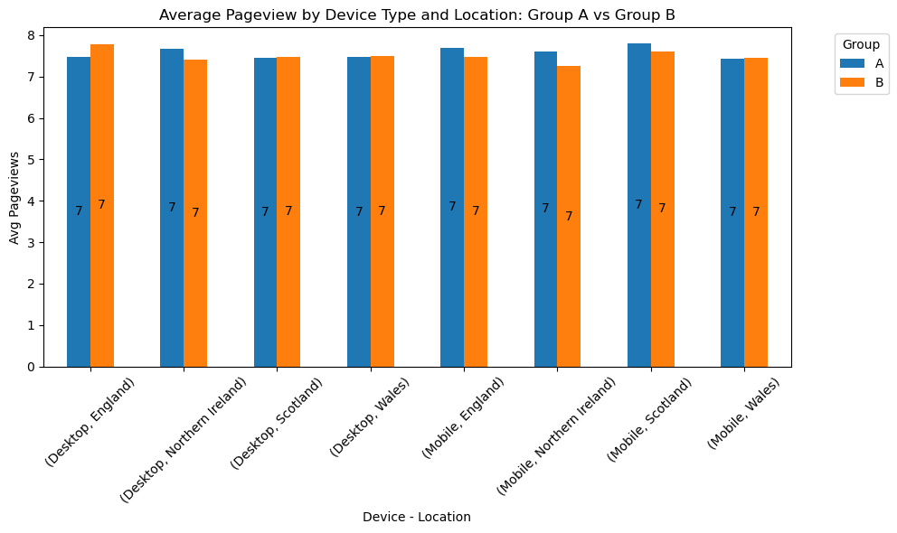
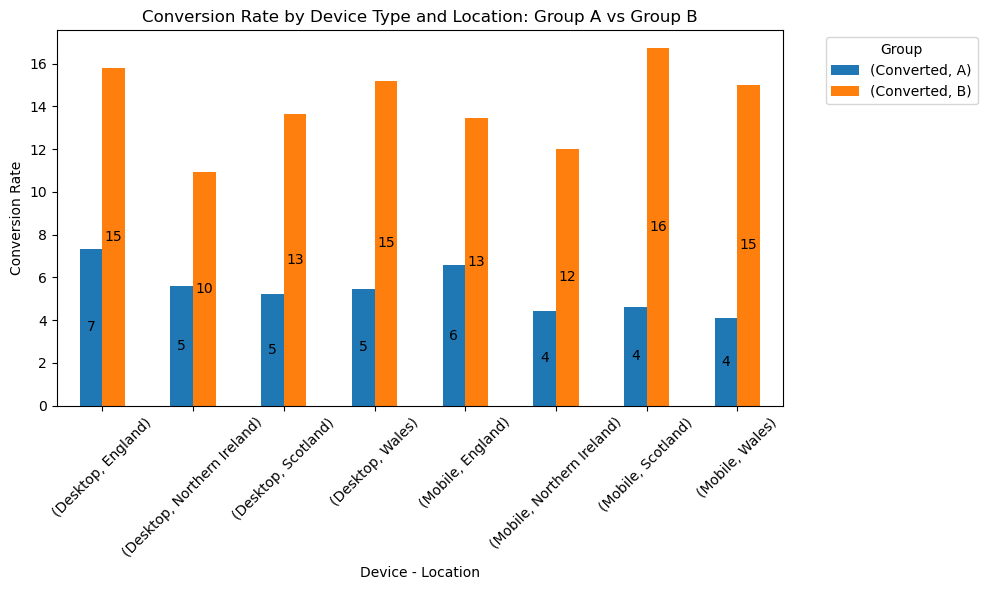

The AB Testing Dataset provided here is a self-generated synthetic dataset created using Random Sampling techniques provided by the Numpy Package. The dataset emulates information regarding visits made by users on an imaginary retail website around the United Kingdom. The users are found to be in two groups, A and B, each of which represents a control group and treatment group respectively.

In this scenario, the retail company needs to test out a new change on the website which is, "Do people spend time on a website if the website background color is White or Black". This question is asked to achieve the end goal of the analysis which is to improve user engagement, whether it is through a purchase, signing up, etc.

Let the color 'White' be assigned to Group A which is the default setting for the background color on the website, representing the control group. Also, let the color 'Black' be equivalent to Group B which is the newer setting to be tested. 

The main goal is to understand whether there is a significant improvement in website views if the newer setting is applied. This can be answered through the use of A/B Testing.

Hypothesis:
+ For conversion rate: H0: No difference in conversion rate between groups. H1: Difference in conversion rate
+ For time spent: H0: No difference in mean time spent. H1: Difference in mean time spent.
+ For page views: H0: No difference in mean page views. H1: Difference in mean page views.


```python
import pandas as pd
import numpy as np
from scipy import stats
import matplotlib.pyplot as plt
```


```python
df = pd.read_csv('ab_testing.csv')
```


```python
df.head()
```


<div>
<style scoped>
    .dataframe tbody tr th:only-of-type {
        vertical-align: middle;
    }

    .dataframe tbody tr th {
        vertical-align: top;
    }

    .dataframe thead th {
        text-align: right;
    }
</style>
<table border="1" class="dataframe">
  <thead>
    <tr style="text-align: right;">
      <th></th>
      <th>User ID</th>
      <th>Group</th>
      <th>Page Views</th>
      <th>Time Spent</th>
      <th>Conversion</th>
      <th>Device</th>
      <th>Location</th>
    </tr>
  </thead>
  <tbody>
    <tr>
      <th>0</th>
      <td>14292</td>
      <td>B</td>
      <td>3</td>
      <td>424</td>
      <td>No</td>
      <td>Mobile</td>
      <td>Northern Ireland</td>
    </tr>
    <tr>
      <th>1</th>
      <td>11682</td>
      <td>A</td>
      <td>9</td>
      <td>342</td>
      <td>No</td>
      <td>Mobile</td>
      <td>Scotland</td>
    </tr>
    <tr>
      <th>2</th>
      <td>19825</td>
      <td>A</td>
      <td>2</td>
      <td>396</td>
      <td>No</td>
      <td>Desktop</td>
      <td>Northern Ireland</td>
    </tr>
    <tr>
      <th>3</th>
      <td>16080</td>
      <td>B</td>
      <td>4</td>
      <td>318</td>
      <td>No</td>
      <td>Desktop</td>
      <td>Wales</td>
    </tr>
    <tr>
      <th>4</th>
      <td>18851</td>
      <td>A</td>
      <td>1</td>
      <td>338</td>
      <td>Yes</td>
      <td>Desktop</td>
      <td>Scotland</td>
    </tr>
  </tbody>
</table>
</div>


```python
df.info()
```

    <class 'pandas.core.frame.DataFrame'>
    RangeIndex: 5000 entries, 0 to 4999
    Data columns (total 7 columns):
     #   Column      Non-Null Count  Dtype 
    ---  ------      --------------  ----- 
     0   User ID     5000 non-null   int64 
     1   Group       5000 non-null   object
     2   Page Views  5000 non-null   int64 
     3   Time Spent  5000 non-null   int64 
     4   Conversion  5000 non-null   object
     5   Device      5000 non-null   object
     6   Location    5000 non-null   object
    dtypes: int64(3), object(4)
    memory usage: 273.6+ KB
    


```python
df.describe()
```


<div>
<style scoped>
    .dataframe tbody tr th:only-of-type {
        vertical-align: middle;
    }

    .dataframe tbody tr th {
        vertical-align: top;
    }

    .dataframe thead th {
        text-align: right;
    }
</style>
<table border="1" class="dataframe">
  <thead>
    <tr style="text-align: right;">
      <th></th>
      <th>User ID</th>
      <th>Page Views</th>
      <th>Time Spent</th>
    </tr>
  </thead>
  <tbody>
    <tr>
      <th>count</th>
      <td>5000.000000</td>
      <td>5000.000000</td>
      <td>5000.000000</td>
    </tr>
    <tr>
      <th>mean</th>
      <td>14925.159000</td>
      <td>7.537600</td>
      <td>242.512600</td>
    </tr>
    <tr>
      <th>std</th>
      <td>2869.153773</td>
      <td>4.022465</td>
      <td>118.254153</td>
    </tr>
    <tr>
      <th>min</th>
      <td>10001.000000</td>
      <td>1.000000</td>
      <td>40.000000</td>
    </tr>
    <tr>
      <th>25%</th>
      <td>12456.250000</td>
      <td>4.000000</td>
      <td>137.000000</td>
    </tr>
    <tr>
      <th>50%</th>
      <td>14858.500000</td>
      <td>8.000000</td>
      <td>243.000000</td>
    </tr>
    <tr>
      <th>75%</th>
      <td>17379.750000</td>
      <td>11.000000</td>
      <td>346.000000</td>
    </tr>
    <tr>
      <th>max</th>
      <td>19995.000000</td>
      <td>14.000000</td>
      <td>449.000000</td>
    </tr>
  </tbody>
</table>
</div>


```python
# Check for nulls
df.isnull().sum()
```


    User ID       0
    Group         0
    Page Views    0
    Time Spent    0
    Conversion    0
    Device        0
    Location      0
    dtype: int64


```python
# checking group balance:
df['Group'].value_counts()
```


    Group
    A    2519
    B    2481
    Name: count, dtype: int64


=> 2519/2481 is roughly 50.4/49.6. The Sample Ratio Mismatch is less than 1%, then I would consider this is an acceptable SRM.


```python
df['Conversion'].value_counts()
```


    Conversion
    No     4515
    Yes     485
    Name: count, dtype: int64


Page Views, Time Spent are numeric. Conversion has only Yes/No value. 

Lets check for outliners using z-score > 3 or z-score <-3


```python
df['Device'].value_counts()
```


    Device
    Desktop    2538
    Mobile     2462
    Name: count, dtype: int64


```python
from scipy.stats import zscore
# Outliners from Pageviews: 
df['z_score'] = zscore(df['Page Views'])
outliers = df[np.abs(df['z_score']) > 3]
outliers
```


<div>
<style scoped>
    .dataframe tbody tr th:only-of-type {
        vertical-align: middle;
    }

    .dataframe tbody tr th {
        vertical-align: top;
    }

    .dataframe thead th {
        text-align: right;
    }
</style>
<table border="1" class="dataframe">
  <thead>
    <tr style="text-align: right;">
      <th></th>
      <th>User ID</th>
      <th>Group</th>
      <th>Page Views</th>
      <th>Time Spent</th>
      <th>Conversion</th>
      <th>Device</th>
      <th>Location</th>
      <th>z_score</th>
    </tr>
  </thead>
  <tbody>
  </tbody>
</table>
</div>


```python
# Outliners from Time Spent: 
df['z_score'] = zscore(df['Time Spent'])
outliers = df[np.abs(df['z_score']) > 3]
outliers
```


<div>
<style scoped>
    .dataframe tbody tr th:only-of-type {
        vertical-align: middle;
    }

    .dataframe tbody tr th {
        vertical-align: top;
    }

    .dataframe thead th {
        text-align: right;
    }
</style>
<table border="1" class="dataframe">
  <thead>
    <tr style="text-align: right;">
      <th></th>
      <th>User ID</th>
      <th>Group</th>
      <th>Page Views</th>
      <th>Time Spent</th>
      <th>Conversion</th>
      <th>Device</th>
      <th>Location</th>
      <th>z_score</th>
    </tr>
  </thead>
  <tbody>
  </tbody>
</table>
</div>


```python
# Outliners from : 
df['z_score'] = zscore(df['Time Spent'])
outliers = df[np.abs(df['z_score']) > 3]
outliers
```


<div>
<style scoped>
    .dataframe tbody tr th:only-of-type {
        vertical-align: middle;
    }

    .dataframe tbody tr th {
        vertical-align: top;
    }

    .dataframe thead th {
        text-align: right;
    }
</style>
<table border="1" class="dataframe">
  <thead>
    <tr style="text-align: right;">
      <th></th>
      <th>User ID</th>
      <th>Group</th>
      <th>Page Views</th>
      <th>Time Spent</th>
      <th>Conversion</th>
      <th>Device</th>
      <th>Location</th>
      <th>z_score</th>
    </tr>
  </thead>
  <tbody>
  </tbody>
</table>
</div>


+ Both Time Spent and Page Views has no outliner, then we are good to go


```python
df['Converted'] = df['Conversion'].map({'Yes': 1, 'No': 0})
```


```python
# Quick Overview of Avg Time_spent, Avg Page_views and conversion rate between two group
df.groupby(['Group']).agg({'Time Spent': 'mean', 'Page Views': 'mean', 'Converted': 'mean'})
```


<div>
<style scoped>
    .dataframe tbody tr th:only-of-type {
        vertical-align: middle;
    }

    .dataframe tbody tr th {
        vertical-align: top;
    }

    .dataframe thead th {
        text-align: right;
    }
</style>
<table border="1" class="dataframe">
  <thead>
    <tr style="text-align: right;">
      <th></th>
      <th>Time Spent</th>
      <th>Page Views</th>
      <th>Converted</th>
    </tr>
    <tr>
      <th>Group</th>
      <th></th>
      <th></th>
      <th></th>
    </tr>
  </thead>
  <tbody>
    <tr>
      <th>A</th>
      <td>241.733227</td>
      <td>7.581580</td>
      <td>0.053990</td>
    </tr>
    <tr>
      <th>B</th>
      <td>243.303910</td>
      <td>7.492946</td>
      <td>0.140669</td>
    </tr>
  </tbody>
</table>
</div>


Based on this table, we could see the time_spent and Page_views are identical, however the testing group yields higher coversion rate.
Lets dig deeper to see if the difference is statistically significant.


```python
device = df.groupby(['Group','Device']).agg({'User ID': 'count'})
device
```


<div>
<style scoped>
    .dataframe tbody tr th:only-of-type {
        vertical-align: middle;
    }

    .dataframe tbody tr th {
        vertical-align: top;
    }

    .dataframe thead th {
        text-align: right;
    }
</style>
<table border="1" class="dataframe">
  <thead>
    <tr style="text-align: right;">
      <th></th>
      <th></th>
      <th>User ID</th>
    </tr>
    <tr>
      <th>Group</th>
      <th>Device</th>
      <th></th>
    </tr>
  </thead>
  <tbody>
    <tr>
      <th rowspan="2" valign="top">A</th>
      <th>Desktop</th>
      <td>1244</td>
    </tr>
    <tr>
      <th>Mobile</th>
      <td>1275</td>
    </tr>
    <tr>
      <th rowspan="2" valign="top">B</th>
      <th>Desktop</th>
      <td>1294</td>
    </tr>
    <tr>
      <th>Mobile</th>
      <td>1187</td>
    </tr>
  </tbody>
</table>
</div>


```python
device_unstack = device['User ID'].unstack(level='Device')
device_unstack
```


<div>
<style scoped>
    .dataframe tbody tr th:only-of-type {
        vertical-align: middle;
    }

    .dataframe tbody tr th {
        vertical-align: top;
    }

    .dataframe thead th {
        text-align: right;
    }
</style>
<table border="1" class="dataframe">
  <thead>
    <tr style="text-align: right;">
      <th>Device</th>
      <th>Desktop</th>
      <th>Mobile</th>
    </tr>
    <tr>
      <th>Group</th>
      <th></th>
      <th></th>
    </tr>
  </thead>
  <tbody>
    <tr>
      <th>A</th>
      <td>1244</td>
      <td>1275</td>
    </tr>
    <tr>
      <th>B</th>
      <td>1294</td>
      <td>1187</td>
    </tr>
  </tbody>
</table>
</div>


```python
ax = device_unstack.plot(kind='bar', stacked=True, title='User Counts by Group and Device Type')
ax.set_ylabel('Number of Users')
ax.set_xlabel('Group')
ax.legend(title='Device')

for i, patch in enumerate(ax.patches):
    height = patch.get_height()
    if height > 0:  # Avoid labeling zero-height segments
        ax.text(patch.get_x() + patch.get_width() / 2, 
                patch.get_y() + height / 2, 
                int(height), 
                ha='center', va='center')

plt.show()
```


    

    


+ Both Group has smilar usercount for each device type


```python
location = df.groupby(['Group','Location']).agg({'User ID': 'count'})
location
```


<div>
<style scoped>
    .dataframe tbody tr th:only-of-type {
        vertical-align: middle;
    }

    .dataframe tbody tr th {
        vertical-align: top;
    }

    .dataframe thead th {
        text-align: right;
    }
</style>
<table border="1" class="dataframe">
  <thead>
    <tr style="text-align: right;">
      <th></th>
      <th></th>
      <th>User ID</th>
    </tr>
    <tr>
      <th>Group</th>
      <th>Location</th>
      <th></th>
    </tr>
  </thead>
  <tbody>
    <tr>
      <th rowspan="4" valign="top">A</th>
      <th>England</th>
      <td>606</td>
    </tr>
    <tr>
      <th>Northern Ireland</th>
      <td>614</td>
    </tr>
    <tr>
      <th>Scotland</th>
      <td>670</td>
    </tr>
    <tr>
      <th>Wales</th>
      <td>629</td>
    </tr>
    <tr>
      <th rowspan="4" valign="top">B</th>
      <th>England</th>
      <td>640</td>
    </tr>
    <tr>
      <th>Northern Ireland</th>
      <td>628</td>
    </tr>
    <tr>
      <th>Scotland</th>
      <td>611</td>
    </tr>
    <tr>
      <th>Wales</th>
      <td>602</td>
    </tr>
  </tbody>
</table>
</div>


```python
location_unstack = location['User ID'].unstack(level='Location')
location_unstack
```


<div>
<style scoped>
    .dataframe tbody tr th:only-of-type {
        vertical-align: middle;
    }

    .dataframe tbody tr th {
        vertical-align: top;
    }

    .dataframe thead th {
        text-align: right;
    }
</style>
<table border="1" class="dataframe">
  <thead>
    <tr style="text-align: right;">
      <th>Location</th>
      <th>England</th>
      <th>Northern Ireland</th>
      <th>Scotland</th>
      <th>Wales</th>
    </tr>
    <tr>
      <th>Group</th>
      <th></th>
      <th></th>
      <th></th>
      <th></th>
    </tr>
  </thead>
  <tbody>
    <tr>
      <th>A</th>
      <td>606</td>
      <td>614</td>
      <td>670</td>
      <td>629</td>
    </tr>
    <tr>
      <th>B</th>
      <td>640</td>
      <td>628</td>
      <td>611</td>
      <td>602</td>
    </tr>
  </tbody>
</table>
</div>


```python
ax = location_unstack.plot(kind='bar', stacked=True, title='User Counts by Group and Location')
ax.set_ylabel('Number of Users')
ax.set_xlabel('Group')
ax.legend(title='Location',loc='upper left',bbox_to_anchor=(1.05,1))

for i, patch in enumerate(ax.patches):
    height = patch.get_height()
    if height > 0:  # Avoid labeling zero-height segments
        ax.text(patch.get_x() + patch.get_width() / 2, 
                patch.get_y() + height / 2, 
                int(height), 
                ha='center', va='center')

plt.show()
```


    

    


+ Demographic group is similar in both Group


```python
time_spent = df.groupby(['Device', 'Group', 'Location'])['Time Spent'].mean().unstack('Group').fillna(0)
time_spent
```


<div>
<style scoped>
    .dataframe tbody tr th:only-of-type {
        vertical-align: middle;
    }

    .dataframe tbody tr th {
        vertical-align: top;
    }

    .dataframe thead th {
        text-align: right;
    }
</style>
<table border="1" class="dataframe">
  <thead>
    <tr style="text-align: right;">
      <th></th>
      <th>Group</th>
      <th>A</th>
      <th>B</th>
    </tr>
    <tr>
      <th>Device</th>
      <th>Location</th>
      <th></th>
      <th></th>
    </tr>
  </thead>
  <tbody>
    <tr>
      <th rowspan="4" valign="top">Desktop</th>
      <th>England</th>
      <td>233.909091</td>
      <td>243.964179</td>
    </tr>
    <tr>
      <th>Northern Ireland</th>
      <td>242.965839</td>
      <td>249.862500</td>
    </tr>
    <tr>
      <th>Scotland</th>
      <td>240.537037</td>
      <td>231.118182</td>
    </tr>
    <tr>
      <th>Wales</th>
      <td>254.448718</td>
      <td>248.533981</td>
    </tr>
    <tr>
      <th rowspan="4" valign="top">Mobile</th>
      <th>England</th>
      <td>248.687500</td>
      <td>256.331148</td>
    </tr>
    <tr>
      <th>Northern Ireland</th>
      <td>233.914384</td>
      <td>245.165584</td>
    </tr>
    <tr>
      <th>Scotland</th>
      <td>235.566474</td>
      <td>229.199288</td>
    </tr>
    <tr>
      <th>Wales</th>
      <td>243.160883</td>
      <td>241.604096</td>
    </tr>
  </tbody>
</table>
</div>


```python
ax = time_spent.plot(kind='bar', figsize=(10,6), title='Average Timespent by Device Type and Location: Group A vs Group B')
ax.set_ylabel('Avg Timespent')
ax.set_xlabel('Device - Location') 
ax.legend(title='Group',loc='upper left',bbox_to_anchor=(1.05,1))

for i, patch in enumerate(ax.patches):
    height = patch.get_height()
    if height > 0:
        ax.text(patch.get_x() + patch.get_width() / 2, 
                patch.get_y() + height / 2, 
                int(height), 
                ha='center', va='center')


plt.xticks(rotation=45)
plt.tight_layout()
plt.show()
```


    

    


```python
page_view = df.groupby(['Device', 'Group', 'Location'])['Page Views'].mean().unstack('Group').fillna(0)
page_view
```


<div>
<style scoped>
    .dataframe tbody tr th:only-of-type {
        vertical-align: middle;
    }

    .dataframe tbody tr th {
        vertical-align: top;
    }

    .dataframe thead th {
        text-align: right;
    }
</style>
<table border="1" class="dataframe">
  <thead>
    <tr style="text-align: right;">
      <th></th>
      <th>Group</th>
      <th>A</th>
      <th>B</th>
    </tr>
    <tr>
      <th>Device</th>
      <th>Location</th>
      <th></th>
      <th></th>
    </tr>
  </thead>
  <tbody>
    <tr>
      <th rowspan="4" valign="top">Desktop</th>
      <th>England</th>
      <td>7.472028</td>
      <td>7.782090</td>
    </tr>
    <tr>
      <th>Northern Ireland</th>
      <td>7.677019</td>
      <td>7.403125</td>
    </tr>
    <tr>
      <th>Scotland</th>
      <td>7.456790</td>
      <td>7.469697</td>
    </tr>
    <tr>
      <th>Wales</th>
      <td>7.464744</td>
      <td>7.498382</td>
    </tr>
    <tr>
      <th rowspan="4" valign="top">Mobile</th>
      <th>England</th>
      <td>7.696875</td>
      <td>7.468852</td>
    </tr>
    <tr>
      <th>Northern Ireland</th>
      <td>7.616438</td>
      <td>7.246753</td>
    </tr>
    <tr>
      <th>Scotland</th>
      <td>7.797688</td>
      <td>7.601423</td>
    </tr>
    <tr>
      <th>Wales</th>
      <td>7.441640</td>
      <td>7.460751</td>
    </tr>
  </tbody>
</table>
</div>


```python
ax = page_view.plot(kind='bar', figsize=(10,6), title='Average Pageview by Device Type and Location: Group A vs Group B')
ax.set_ylabel('Avg Pageviews')
ax.set_xlabel('Device - Location') 
ax.legend(title='Group',loc='upper left',bbox_to_anchor=(1.05,1))

for i, patch in enumerate(ax.patches):
    height = patch.get_height()
    if height > 0:
        ax.text(patch.get_x() + patch.get_width() / 2, 
                patch.get_y() + height / 2, 
                int(height), 
                ha='center', va='center')

plt.xticks(rotation=45)
plt.tight_layout()
plt.show()
```


    

    


+ In both Pageviews and Timespent, Group B did not show any significant inprovement compare to Group A. The diffirences are minor and could be neglected.


```python
convert = df.groupby(['Device', 'Group', 'Location']).agg({'Converted':'mean'})
convert['Converted']=convert['Converted']*100
convert = convert.unstack('Group').fillna(0)
convert
```


<div>
<style scoped>
    .dataframe tbody tr th:only-of-type {
        vertical-align: middle;
    }

    .dataframe tbody tr th {
        vertical-align: top;
    }

    .dataframe thead tr th {
        text-align: left;
    }

    .dataframe thead tr:last-of-type th {
        text-align: right;
    }
</style>
<table border="1" class="dataframe">
  <thead>
    <tr>
      <th></th>
      <th></th>
      <th colspan="2" halign="left">Converted</th>
    </tr>
    <tr>
      <th></th>
      <th>Group</th>
      <th>A</th>
      <th>B</th>
    </tr>
    <tr>
      <th>Device</th>
      <th>Location</th>
      <th></th>
      <th></th>
    </tr>
  </thead>
  <tbody>
    <tr>
      <th rowspan="4" valign="top">Desktop</th>
      <th>England</th>
      <td>7.342657</td>
      <td>15.820896</td>
    </tr>
    <tr>
      <th>Northern Ireland</th>
      <td>5.590062</td>
      <td>10.937500</td>
    </tr>
    <tr>
      <th>Scotland</th>
      <td>5.246914</td>
      <td>13.636364</td>
    </tr>
    <tr>
      <th>Wales</th>
      <td>5.448718</td>
      <td>15.210356</td>
    </tr>
    <tr>
      <th rowspan="4" valign="top">Mobile</th>
      <th>England</th>
      <td>6.562500</td>
      <td>13.442623</td>
    </tr>
    <tr>
      <th>Northern Ireland</th>
      <td>4.452055</td>
      <td>12.012987</td>
    </tr>
    <tr>
      <th>Scotland</th>
      <td>4.624277</td>
      <td>16.725979</td>
    </tr>
    <tr>
      <th>Wales</th>
      <td>4.100946</td>
      <td>15.017065</td>
    </tr>
  </tbody>
</table>
</div>


```python
ax = convert.plot(kind='bar', figsize=(10,6), title='Conversion Rate by Device Type and Location: Group A vs Group B')
ax.set_ylabel('Conversion Rate')
ax.set_xlabel('Device - Location') 
ax.legend(title='Group',loc='upper left',bbox_to_anchor=(1.05,1))

for i, patch in enumerate(ax.patches):
    height = patch.get_height()
    if height > 0:
        ax.text(patch.get_x() + patch.get_width() / 2, 
                patch.get_y() + height / 2, 
                int(height), 
                ha='center', va='center')

plt.xticks(rotation=45)
plt.tight_layout()
plt.show()
```


    

    


+ But in Conversion Rate, group B yield significantly higher result in both device type and location

+ The Raw nummber said Group A and B have similar Pageviews and Timespent but Group B has much better Conversion Rate. I would do some statistical tests to confirm these statements.


```python
crosstable = pd.crosstab(df['Group'], df['Conversion'])
crosstable
```


<div>
<style scoped>
    .dataframe tbody tr th:only-of-type {
        vertical-align: middle;
    }

    .dataframe tbody tr th {
        vertical-align: top;
    }

    .dataframe thead th {
        text-align: right;
    }
</style>
<table border="1" class="dataframe">
  <thead>
    <tr style="text-align: right;">
      <th>Conversion</th>
      <th>No</th>
      <th>Yes</th>
    </tr>
    <tr>
      <th>Group</th>
      <th></th>
      <th></th>
    </tr>
  </thead>
  <tbody>
    <tr>
      <th>A</th>
      <td>2383</td>
      <td>136</td>
    </tr>
    <tr>
      <th>B</th>
      <td>2132</td>
      <td>349</td>
    </tr>
  </tbody>
</table>
</div>


```python
chi2, p_chi, dof, expected = stats.chi2_contingency(crosstable)
print(f"Chi-square p-value: {p_chi:.10f}")
print(f"Chi statistic: {chi2:.2f}")
```

    Chi-square p-value: 0.0000000000
    Chi statistic: 106.23
    

+ P-value is less than 0.05, then rejected the Null Hypothesis and accept H1: Difference in conversion rate. And since the result of group B is higher than Group A, we could conclude there is strong statistical evidence that the conversion rate in Group B is higher than in Group A.
+ Lets continue with Page views and Timespent:


```python
groupa = df[df['Group']=='A']
groupb = df[df['Group']=='B']
```


```python
t_stat, p_t = stats.ttest_ind(groupa['Time Spent'], groupb['Time Spent'], equal_var=True)
print(f"Time Spent p-value: {p_t:.4f}")
```

    Time Spent p-value: 0.6387
    


```python
t_stat, p_t = stats.ttest_ind(groupa['Page Views'], groupb['Page Views'], equal_var=True)
print(f"Page Views p-value: {p_t:.4f}")
```

    Page Views p-value: 0.4360
    

+ For both Time Spent and Page Views, the p-value is significantly higher than 0.05. There for accept H0 of both cases. Group B does not have Time Spent and Page Views higher than Group A.
