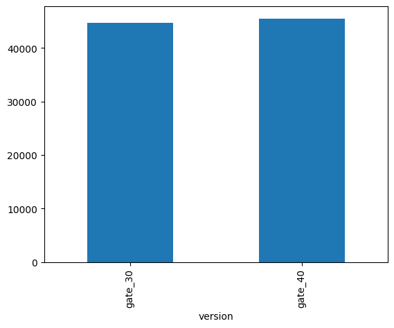
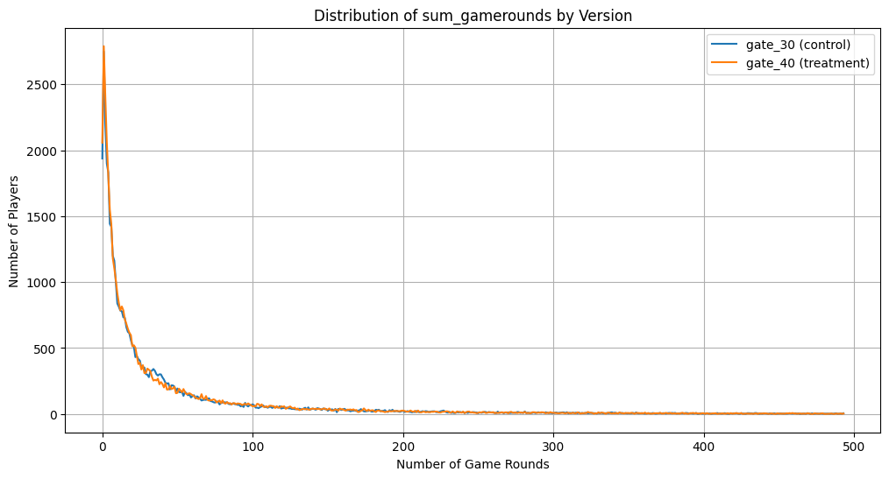

# About the Dataset

## Context

This dataset includes A/B test results of Cookie Cats to examine what happens when the first gate in the game was moved from level 30 to level 40. When a player installed the game, he or she was randomly assigned to either gate_30 or gate_40.
Content

The data we have is from 90,189 players that installed the game while the AB-test was running. The variables are:

- userid: A unique number that identifies each player.
- version: Whether the player was put in the control group (gate_30 - a gate at level 30) or the group with the moved gate (gate_40 - a gate at level 40).
- sum_gamerounds: the number of game rounds played by the player during the first 14 days after install.
- retention_1: Did the player come back and play 1 day after installing?
- retention_7: Did the player come back and play 7 days after installing?

When a player installed the game, he or she was randomly assigned to either. 

## Acknowledgements

This dataset is taken from [DataCamp](https://www.datacamp.com/projects/1611)
Cookie Cat is a hugely popular mobile puzzle game developed by Tactile Entertainment

Thanks to them for this dataset! 😻 

## Hypothesis:
- For Retention Rate:
H0: No difference in retention rates between gate_30 and gate_40
H1: There is a difference in retention rates

- For gamerounds:
H0: No difference in game rounds between gate_30 and gate_40
H1: There is a difference in game rounds


```python
import pandas as pd
import numpy as np
from scipy import stats
import matplotlib.pyplot as plt
```


```python
# Dataset Overview
df = pd.read_csv('cookie_cats.csv')
df.head()
```


<div>
<table border="1" class="dataframe">
  <thead>
    <tr style="text-align: right;">
      <th></th>
      <th>userid</th>
      <th>version</th>
      <th>sum_gamerounds</th>
      <th>retention_1</th>
      <th>retention_7</th>
    </tr>
  </thead>
  <tbody>
    <tr>
      <th>0</th>
      <td>116</td>
      <td>gate_30</td>
      <td>3</td>
      <td>False</td>
      <td>False</td>
    </tr>
    <tr>
      <th>1</th>
      <td>337</td>
      <td>gate_30</td>
      <td>38</td>
      <td>True</td>
      <td>False</td>
    </tr>
    <tr>
      <th>2</th>
      <td>377</td>
      <td>gate_40</td>
      <td>165</td>
      <td>True</td>
      <td>False</td>
    </tr>
    <tr>
      <th>3</th>
      <td>483</td>
      <td>gate_40</td>
      <td>1</td>
      <td>False</td>
      <td>False</td>
    </tr>
    <tr>
      <th>4</th>
      <td>488</td>
      <td>gate_40</td>
      <td>179</td>
      <td>True</td>
      <td>True</td>
    </tr>
  </tbody>
</table>
</div>


```python
df.info()
```

    <class 'pandas.core.frame.DataFrame'>
    RangeIndex: 90189 entries, 0 to 90188
    Data columns (total 5 columns):
     #   Column          Non-Null Count  Dtype 
    ---  ------          --------------  ----- 
     0   userid          90189 non-null  int64 
     1   version         90189 non-null  object
     2   sum_gamerounds  90189 non-null  int64 
     3   retention_1     90189 non-null  bool  
     4   retention_7     90189 non-null  bool  
    dtypes: bool(2), int64(2), object(1)
    memory usage: 2.2+ MB
    

+ retention_1 and retention_7 seem to be in correct format


```python
df.describe()
```


<div>
<table border="1" class="dataframe">
  <thead>
    <tr style="text-align: right;">
      <th></th>
      <th>userid</th>
      <th>sum_gamerounds</th>
    </tr>
  </thead>
  <tbody>
    <tr>
      <th>count</th>
      <td>9.018900e+04</td>
      <td>90189.000000</td>
    </tr>
    <tr>
      <th>mean</th>
      <td>4.998412e+06</td>
      <td>51.872457</td>
    </tr>
    <tr>
      <th>std</th>
      <td>2.883286e+06</td>
      <td>195.050858</td>
    </tr>
    <tr>
      <th>min</th>
      <td>1.160000e+02</td>
      <td>0.000000</td>
    </tr>
    <tr>
      <th>25%</th>
      <td>2.512230e+06</td>
      <td>5.000000</td>
    </tr>
    <tr>
      <th>50%</th>
      <td>4.995815e+06</td>
      <td>16.000000</td>
    </tr>
    <tr>
      <th>75%</th>
      <td>7.496452e+06</td>
      <td>51.000000</td>
    </tr>
    <tr>
      <th>max</th>
      <td>9.999861e+06</td>
      <td>49854.000000</td>
    </tr>
  </tbody>
</table>
</div>


```python
df.isna().sum()
```


    userid            0
    version           0
    sum_gamerounds    0
    retention_1       0
    retention_7       0
    dtype: int64


+ No null value


```python
df.groupby('version')['userid'].nunique()
```


    version
    gate_30    44700
    gate_40    45489
    Name: userid, dtype: int64


+ This represents a 49.6/50.4 split. Acceptable ratio.


```python
df.groupby('version')['userid'].nunique().plot(kind='bar')

```


    <Axes: xlabel='version'>


    

    


```python
# Lets check the gamerounds metric
df.groupby(['version'])["sum_gamerounds"].value_counts().unstack(fill_value=0)
```


<div>
<table border="1" class="dataframe">
  <thead>
    <tr style="text-align: right;">
      <th>sum_gamerounds</th>
      <th>0</th>
      <th>1</th>
      <th>2</th>
      <th>3</th>
      <th>4</th>
      <th>5</th>
      <th>6</th>
      <th>7</th>
      <th>8</th>
      <th>9</th>
      <th>...</th>
      <th>2015</th>
      <th>2063</th>
      <th>2124</th>
      <th>2156</th>
      <th>2251</th>
      <th>2294</th>
      <th>2438</th>
      <th>2640</th>
      <th>2961</th>
      <th>49854</th>
    </tr>
    <tr>
      <th>version</th>
      <th></th>
      <th></th>
      <th></th>
      <th></th>
      <th></th>
      <th></th>
      <th></th>
      <th></th>
      <th></th>
      <th></th>
      <th></th>
      <th></th>
      <th></th>
      <th></th>
      <th></th>
      <th></th>
      <th></th>
      <th></th>
      <th></th>
      <th></th>
      <th></th>
    </tr>
  </thead>
  <tbody>
    <tr>
      <th>gate_30</th>
      <td>1937</td>
      <td>2749</td>
      <td>2198</td>
      <td>1899</td>
      <td>1831</td>
      <td>1442</td>
      <td>1420</td>
      <td>1199</td>
      <td>1162</td>
      <td>998</td>
      <td>...</td>
      <td>0</td>
      <td>0</td>
      <td>0</td>
      <td>1</td>
      <td>1</td>
      <td>0</td>
      <td>1</td>
      <td>0</td>
      <td>1</td>
      <td>1</td>
    </tr>
    <tr>
      <th>gate_40</th>
      <td>2057</td>
      <td>2789</td>
      <td>2408</td>
      <td>2059</td>
      <td>1798</td>
      <td>1550</td>
      <td>1441</td>
      <td>1180</td>
      <td>1105</td>
      <td>1015</td>
      <td>...</td>
      <td>1</td>
      <td>1</td>
      <td>1</td>
      <td>0</td>
      <td>0</td>
      <td>1</td>
      <td>0</td>
      <td>1</td>
      <td>0</td>
      <td>0</td>
    </tr>
  </tbody>
</table>
<p>2 rows × 942 columns</p>
</div>


+ There are outliners in this metric. I would remove any value over 99% percentile.


```python
q99 = df['sum_gamerounds'].quantile(0.99)
df_cleaned = df[df['sum_gamerounds'] <= q99]
df_cleaned.info()
```

    <class 'pandas.core.frame.DataFrame'>
    Index: 89291 entries, 0 to 90188
    Data columns (total 5 columns):
     #   Column          Non-Null Count  Dtype 
    ---  ------          --------------  ----- 
     0   userid          89291 non-null  int64 
     1   version         89291 non-null  object
     2   sum_gamerounds  89291 non-null  int64 
     3   retention_1     89291 non-null  bool  
     4   retention_7     89291 non-null  bool  
    dtypes: bool(2), int64(2), object(1)
    memory usage: 2.9+ MB
    


```python
game_rounds = df_cleaned.groupby(['version'])["sum_gamerounds"].value_counts().unstack(fill_value=0)
```


```python
plt.figure(figsize=(12,6))
plt.plot(game_rounds.columns, game_rounds.loc['gate_30'], label='gate_30 (control)')
plt.plot(game_rounds.columns, game_rounds.loc['gate_40'], label='gate_40 (treatment)')

plt.xlabel('Number of Game Rounds')
plt.ylabel('Number of Players')
plt.title('Distribution of sum_gamerounds by Version')
plt.legend()
plt.grid(True)
plt.show()
```


    

    


+ After removing outliners, the distribution of game rounds between 2 version are identicle.
+ However in this graph, I noticed there is a portion of the population installed the game but never play a single round!


```python
df_cleaned[df_cleaned['sum_gamerounds']==0].groupby('version')['userid'].count()
```


    version
    gate_30    1937
    gate_40    2057
    Name: userid, dtype: int64


+ 3994 players out of 89291 (4.5%) had installed the game but never play a single round.
This could be because of:
+ They were busy with other tasks
+ The game lost its appeal after installation
+ Technical issues


```python
# Retention overview
crosstable = df_cleaned.groupby('version').agg({'userid':'count','retention_1':'mean','retention_7':'mean','sum_gamerounds':'sum'})
crosstable
```


<div>
<table border="1" class="dataframe">
  <thead>
    <tr style="text-align: right;">
      <th></th>
      <th>userid</th>
      <th>retention_1</th>
      <th>retention_7</th>
      <th>sum_gamerounds</th>
    </tr>
    <tr>
      <th>version</th>
      <th></th>
      <th></th>
      <th></th>
      <th></th>
    </tr>
  </thead>
  <tbody>
    <tr>
      <th>gate_30</th>
      <td>44254</td>
      <td>0.442920</td>
      <td>0.182537</td>
      <td>1976494</td>
    </tr>
    <tr>
      <th>gate_40</th>
      <td>45037</td>
      <td>0.436907</td>
      <td>0.174190</td>
      <td>1999480</td>
    </tr>
  </tbody>
</table>
</div>


Based on this table, in the gate_40 group:
+ There is a slight decrease in retention_1 (down to 44.22% frp, 44.81%)
+ There is a slight decrease in retention_7 (down to 18.2% from 19.02%)
+ This also cause a slight decrease in gamerounds
Since retention are categories, I would perform a chi-square test to determind if the drop in retention is significant for both retention_1 and retention_7


```python
t1 = pd.crosstab(df_cleaned['version'],df_cleaned['retention_1'])
chi2, p_chi, dof, expected = stats.chi2_contingency(t1)
print(f"Chi-square p-value: {p_chi:.10f}")
print(f"Chi statistic: {chi2:.2f}")
```

    Chi-square p-value: 0.0713738820
    Chi statistic: 3.25
    


```python
t2 = pd.crosstab(df_cleaned['version'],df_cleaned['retention_7'])
chi2, p_chi, dof, expected = stats.chi2_contingency(t2)
print(f"Chi-square p-value: {p_chi:.10f}")
print(f"Chi statistic: {chi2:.2f}")
```

    Chi-square p-value: 0.0011576307
    Chi statistic: 10.56
    

+ For sum_gamerounds, this is a continuos variable and sensitive to skewness even after removing the 99% percentile. I would take the mannwhitneyu test for this metric


```python
from scipy.stats import mannwhitneyu
```


```python
group_30 = df_cleaned[df_cleaned['version']=='gate_30']['sum_gamerounds']
group_40 = df_cleaned[df_cleaned['version']=='gate_40']['sum_gamerounds']
```


```python
stat, p_mw = mannwhitneyu( group_30,group_40, alternative='two-sided')
print(f"Mann-Whitney U p-value: {p_mw:.10f}")
```

    Mann-Whitney U p-value: 0.0478900069
    

From the test:
+ sum_gamerounds p-value is less than 0.05, there IS a statistically significant difference between group_30 and group_40 in gamerounds
+ retention_1 p-value is higher than 0.05, there is NO statistically significant difference between group_30 and group_40 in day 1 retention rate
+ retention_7 p-value is less than 0.05, there IS a statistically significant difference between group_30 and group_40 in day 7 retention rate

## CONCLUSION:
+ By increasing the game difficulty from level 30 to level 40. There is a drop in retention rate and gamerounds after 7 days.
SUGGESTION:
+ We should not move the difficulty suddenly from level 30 to level 40.
+ We could look at other metric like ingame purchase to further evaluate the changes.
+ There is a 4.5% of the player base installed but did not play any round. Perhap we could reach out to this group to figure out the reason they did not continue.
